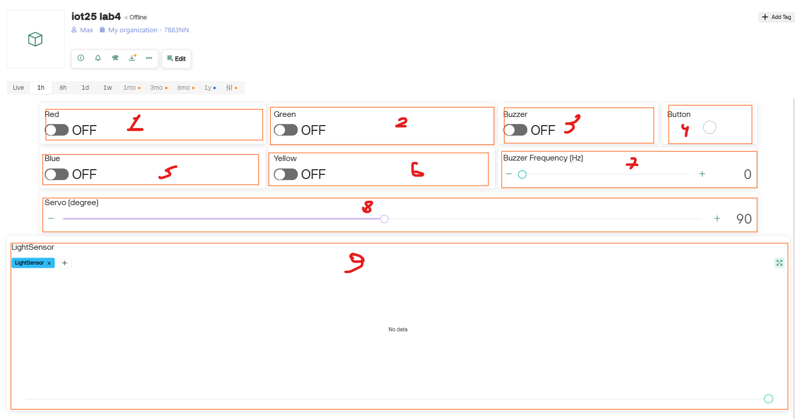

# IoT 2025 - Lab 4 Template

# Lab 4 - ESP32 + Blynk Service

---

### Setup Configuration in this Wokwi Project template:

- RED LED - `D26`
- Green LED - `D27`
- Blue LED - `D14`
- Yellow LED - `D12`

- Button (Active high) - `D25`
- Light sensor (analog) - `D33`

- LCD I2C - SDA: `D21`
- LCD I2C - SCL: `D22`

- Servo Motor: `D5`

- Buzzer: `D32`

--------------------------------
**Wokwi Design screenshot**:

--------------------------------
**Blynk Device Dashboard screenshot**:

----------

## Exercises (read carefully)

### Blynk Dashboard — Virtual Pins
- V1: Red LED (switch)
- V2: Green LED (switch)
- V5: Blue LED (switch)
- V6: Yellow LED (switch)
- V3: Buzzer ON/OFF (switch)
- V7: Buzzer Frequency (Hz) slider
- V8: Servo Degree slider (0–180)
- V4: Button status indicator (virtual LED)
- V9: Light sensor chart (push every 5 s)

### Exercise 1 — Dashboard ↔ Hardware I/O
Implement the bindings between the Blynk dashboard and the Wokwi hardware in `src/lab4_ex1.cpp`.
- LEDs: mirror V1/V2/V5/V6 to pins D26/D27/D14/D12.
- Buzzer: when V3 turns ON, play tone at current V7 frequency for at most 3 seconds, then auto‑OFF; turning V3 OFF stops immediately. Frequency 0 = silent.
- Button: read D25, send state to V4 (pressed/released). Add minimal debounce.
- Servo: set D5 angle from V8 (0–180).
- Light sensor: read D33 every 5 seconds and push the raw ADC value to V9.
- LCD (I2C D21/D22):
  - Line 1: latest event text (e.g., "Btn: pressed", "Red: ON", "Buz: ON 880Hz", "Servo: 90°").
  - Line 2: `L=<value>` showing the latest light reading.
- Non‑blocking: avoid long delays. Use timers/millis for 3 s buzzer cap and 5 s sensor polling.

### Exercise 2 — EX1 + OTA
Extend EX1 by adding OTA updates in `src/lab4_ex2.cpp` (use the provided OTA example as reference).
- While idle, all EX1 features remain functional.
- On OTA start, show `OTA...` on LCD line 1; on success, show `OTA OK`.
- In `lab4_ex2.cpp` comments, note how to upload via OTA Blynk.

### Deliverables / Checklist
- EX1: All widgets work; LCD shows latest event (line 1) and light value (line 2); light pushed every 5 s; buzzer auto‑stops <= 3 s.
- EX2: OTA works and shows messages on LCD; EX1 features preserved.

